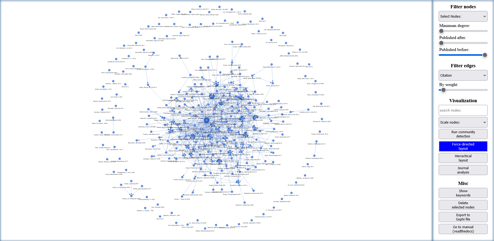

# PyblioNet

PyblioNet is a software tool for the creation, visualization and analysis of bibliometric networks. It combines a Python-based data collection tool that accesses the Scopus database with a browser-based visualization and analysis tool. It allows users to create networks of publication data based on citations, co-citations, co-authorships, bibliographic coupling, and shared keywords. 

## Description
The first component is a python based data collection tool which downloads publication data from the Scopus database via [Pybliometrics](https://pybliometrics.readthedocs.io/en/stable/). Initial Scopus search is done by the user via advanced search query strings using the scopus search api. Based on this initial publication data, further information on cited and citing research are collected which e.g. allows for computing bibliographic coupling and co-citation relationships for the initial publication data (using the scopus Abstract Retrieval API and scopus Search API). The publication data is then used to create a network where each publication is represented as a node in the network. Relationships are computed based on citation analysis, co-citation analysis, co-authorship analysis, bibliographic coupling and keyword analysis.

The second component is a html / JavaScript analysis and visualisation tool building on the [VisJs](https://visjs.github.io/vis-network/docs/network/) Package. In the network each node represents a publication. Each edge represents a relation between two publications. Nodes’ positions are calculated via a force-directed or hierarchical layout algorithm. The analysis tool allows for filtering, and graphical analysis. Filtering can be done based on publication date, degree centrality or weight etc. Graphical analysis covers e.g. searching and highlighting nodes based on user input, community detection based on a louvain cluster detection method etc.

## Usage

Users can use PyblioNet by executing a Python file, which requires the installation of the libraries such as [Pybliometrics](https://pybliometrics.readthedocs.io/en/stable/), [NetworkX](https://github.com/networkx/networkx), etc. Alternatively, users can run the exe file, which includes all necessary libraries. 

### Downloading publication data
For the first use, users need to enter a valid Scopus API key in order to access the database via Pybliometrics ([Scopus APi key](https://dev.elsevier.com/sc_apis.html)). After that, users can start by entering Scopus advanced search query strings. PyblioNet will display how many publications were found using the search query and ask the user if they want to continue. If so, the user can continue with a standard setting, or with an advanced mode where the user can decide on the following settings: 
-	Minimum citation count: exclude search results based on their citations. (standard: 0)
-	Use cached data if possible: download publication data even if it is data cached on your computer. (default: yes)
-	Download information about citing papers: downloading information on publications citing the search results is necessary for co-citation analysis but takes additional time. (default: yes)
-	Create extra nodes for references and citing papers: creating extra nodes for references and citing papers can result in huge networks that may be too large to visualize. If the user chooses “later”, PiblioNet will ask for a minimum occurrence of extra nodes for references and citing papers. (default: yes)
-	Download abstracts: downloading abstracts for search results increases the size of the html file and takes additional time. (default: yes)
-	Minimum weight for bibliographic coupling: include bibliographic coupling links between publications only if there are at least x shared references (reduces network size). (default: 0)
-	Minimum weight for co-citation: include co-citation links between publications only if there are at least x shared citing publications (reduces network size). (default: 0)
-	Minimum weight for shared keywords: include shared keyword links between publications only if there are at least x shared keywords (reduces network size). (default: 0)
-	Create Gephi file: Creates an additional .gexf file of the network which can be opened in Gephi. (default: no)

A single HTML file is created that contains both the network data and the analysis and visualization tools.

** Visualization and analysis **

PyblioNet also allows for different filtering and visualization methods. 

Filtering: 
- users can choose to display only publication data from the main search results or also citing and cited publications.
- Further filtering of nodes can be done based on publication date, or the current degree centrality.
- Link filtering allows users to easily switch between the five network levels co-authorship, citation, bibliographic coupling, co-citation or shared keywords.
- In the case of bibliographic coupling, co-citation and keyword relationships, links can additionally be filtered by their weight (representing the number of commonly cited or citing literature or keywords).
  
** Visualization: ** 
- users can enter search queries to highlight nodes where e.g. the search query “agent based and network” will highlight nodes that mention “agent based” and “network”.
- Resizing nodes can be done based on their current degree centrality (and in case of citation networks also based on their in-degree or out-degree) or number of citations.
- Recoloring of nodes can be done to identify cluster structures within large and dense networks using a Louvain community detection algorithm as implemented in [JLouvain](https://github.com/upphiminn/jLouvain), or based on common journals (node colors are also used to identify clusters that are analyzed in more detail using the “Show information” button).
- The default visualization of nodes is based on a force-directed layout algorithm placing well-connected nodes in the center of the network and less well-connected nodes at the periphery.
- Users can also choose to use a hierarchical layout where the y-coordinate of nodes in the canvas is based on the publication year, hereby positioning older publications at the top and newer ones at the bottom (in case of a citation network, for example, the hierarchical layout shows the cumulative nature of a research field). 

Misc:
- the “Show information” button opens a new window showing the number of nodes and edges as well as the most frequent keywords and journals. If users have previously colored nodes (based on the Louvain algorithm or common journals), additional information for the communities is displayed. Additionally, users can delete selected nodes (for selecting multiple nodes, press and hold Ctrl),
- export the current set of nodes in a Gephi compatible format,
- or display additional navigation buttons.    

Direct user interaction: 
- such as repositioning nodes manually via drag-and-drop, 
- hovering over nodes to get more information such as abstract, keywords etc.
- highlighting nodes and their direct peers by clicking on a node e.g. to identify related literature.
- To quickly access the publication directly from the publisher, double-clicking on a node opens a new tab using the publication’s DOI or, if not available, opens google scholar with the publication’s title as a search query. 

## Installation
Download the .py and template.html file. Make sure they are in the same directory and run the Python file. Alternatively to the python file you can download the .exe and run it.

## Support
Contact: m_mueller@uni-hohenheim.de

## License
MIT License; see [LICENSE](https://aidaho-edu.uni-hohenheim.de/gitlab/M_Mueller/pyblionet/-/blob/main/license).

