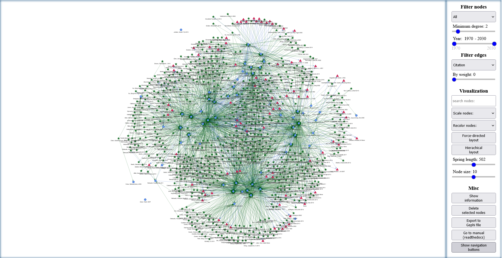

PyblioNet
============

PyblioNet is a software tool for the creation, visualization and analysis of bibliometric networks. It combines a Python-based data collection tool that accesses the Scopus database with a browser-based visualization and analysis tool. It allows users to create networks of publication data based on citations, co-citations, co-authorships, bibliographic coupling, and shared keywords. 

Description
============

The first component is a python based data collection tool which downloads publication data from the Scopus database via `Pybliometrics <https://pybliometrics.readthedocs.io/en/stable/>`_. Initial Scopus search is done by the user via advanced search query strings using the scopus search api. Based on this initial publication data, further information on cited and citing research are collected which e.g. allows for computing bibliographic coupling and co-citation relationships for the initial publication data (using the scopus Abstract Retrieval API and scopus Search API). The publication data is then used to create a network where each publication is represented as a node in the network. Relationships are computed based on citation analysis, co-citation analysis, co-authorship analysis, bibliographic coupling and keyword analysis.

The second component is a html / JavaScript analysis and visualisation tool building on the `VisJs <https://visjs.github.io/vis-network/docs/network/>`_ Package. In the network each node represents a publication. Each edge represents a relation between two publications. Nodes’ positions are calculated via a force-directed or hierarchical layout algorithm. The analysis tool allows for filtering, and graphical analysis. Filtering can be done based on publication date, degree centrality or weight etc. Graphical analysis covers e.g. searching and highlighting nodes based on user input, community detection based on a louvain cluster detection method etc.

Usage
============

Users can use PyblioNet by executing a Python file, which requires the installation of the libraries such as `Pybliometrics <https://pybliometrics.readthedocs.io/en/stable/>`_, `NetworkX <https://github.com/networkx/networkx>`_ , etc. Alternatively, users can run the exe file, which includes all necessary libraries. 

Downloading publication data
-------

For the first use, users need to enter a valid Scopus API key in order to access the database via Pybliometrics (see also `here <https://dev.elsevier.com/sc_apis.html>`_). After that, users can start by entering Scopus advanced search query strings. PyblioNet will display how many publications were found using the search query and ask the user if they want to continue. If so, the user can continue with a standard setting, or with an advanced mode where the user can decide on the following settings:

*	Minimum citation count: exclude search results based on their citations. (standard: 0)
*	Use cached data if possible: download publication data even if it is data cached on your computer. (default: yes)
*	Download information about citing papers: downloading information on publications citing the search results is necessary for co-citation analysis but takes additional time. (default: yes)
*	Create extra nodes for references and citing papers: creating extra nodes for references and citing papers can result in huge networks that may be too large to visualize. If the user chooses “later”, PiblioNet will ask for a minimum occurrence of extra nodes for references and citing papers. (default: yes)
*	Download abstracts: downloading abstracts for search results increases the size of the html file and takes additional time. (default: yes)
*	Minimum weight for bibliographic coupling: include bibliographic coupling links between publications only if there are at least x shared references (reduces network size). (default: 0)
*	Minimum weight for co-citation: include co-citation links between publications only if there are at least x shared citing publications (reduces network size). (default: 0)
*	Minimum weight for shared keywords: include shared keyword links between publications only if there are at least x shared keywords (reduces network size). (default: 0)
*	Create Gephi file: Creates an additional .gexf file of the network which can be opened in Gephi. (default: no)

A single HTML file is created that contains both the network data and the analysis and visualization tools.

Visualization and analysis
-------

PyblioNet also allows for different filtering and visualization methods. 

**Filtering:** 

* Filter by type of nodes (only publication data from the main search results, citing or cited publications)
* Filter by publication date
* Filter by degree centrality
* Filter links by network level (co-authorship, citation, bibliographic coupling, co-citation or shared keywords)
* Filter by weight (number of commonly cited or citing literature or keywords, only in the case of bibliographic coupling, co-citation and keyword relationships) 
  
**Visualization:** 

* Enter search queries to highlight nodes
* Resize nodes by their current degree centrality or number of citations (in case of citation networks also based on their in-degree or out-degree)
* Recolor based on a Louvain community detection algorithm as implemented in [JLouvain](https://github.com/upphiminn/jLouvain), or based on common journals
* Activate a force-directed layout algorithm placing well-connected nodes in the center of the network and less well-connected nodes at the periphery
* Activate hierarchical layout where the y-coordinate of nodes in the canvas is based on the publication year, hereby positioning older publications at the top and newer ones at the bottom
* Change the spring length between nodes
* Change overall node size

**Misc:**

* “Show information” opens a new window showing the number of nodes and edges as well as the most frequent keywords and journals (if users have previously colored nodes, additional information for the communities is displayed)
* Delete selected nodes (for selecting multiple nodes, press and hold Ctrl)
* Export the current set of nodes in a Gephi compatible format
* Display additional navigation buttons   

**Direct user interaction:** 

* Manually reposition nodes via drag-and-drop
* Hover over nodes to get more information such as abstract, keywords etc.
* Highlight nodes and their direct peers by clicking on a node
* Access the publication directly from the publisher by double-clicking on a node (opens a new tab using the publication’s DOI or, if not available, opens google scholar with the publication’s title as a search query) 

Installation
=====

Download the .py and template.html file. Make sure they are in the same directory and run the Python file. Alternatively, download the .exe and template.html file.

Support
=====

Contact: m_mueller@uni-hohenheim.de

License
=====

MIT License; see [LICENSE](https://aidaho-edu.uni-hohenheim.de/gitlab/M_Mueller/pyblionet/-/blob/main/license).

Description
============

Pyblionet covers two main components. The first component is a python based data collection tool which downloads publication data from the Scopus database via Pybliometrics. Initial Scopus search is done by the user via advanced search query strings using the scopus search api. Based on this initial publication data, further information on cited and citing research are collected which e.g. allows for computing bibliographic coupling and co-citation relationships for the initial publication data (using the scopus Abstract Retrieval API and scopus Search API). The publication data is then used to create a network where each publication is represented as a node in the network. Relationships are computed based on citation analysis, co-citation analysis, co-authorship analysis, bibliographic coupling and keyword analysis.
The second component is a html / JavaScript analysis and visualisation tool building on the VisJs Package. In the network each node represents a publication. Each edge represents a relation between two publications. Nodes’ positions are calculated via a force-directed or hierarchical layout algorithm. The analysis tool allows for filtering, and graphical analysis. Filtering can be done based on publication date, degree centrality or weight etc. Graphical analysis covers e.g. searching and highlighting nodes based on user input, community detection based on a louvain cluster detection method etc.

Installation
============
Download the .py and template.html file. Make sure they are in the same directory and run the Python file. Alternatively to the python file you can download the .exe and run it.

Usage
======
Start the .py or .exe file. Upon first usage you will need to enter a Scopus APi key. Afterwards, simply enter your search term and follow the instructions. PyblioNet will download all relevant data and create a html file with the resulting network.

Data collection tool
====================
PyblioNet downloads publication data from the Scopus database via the Pybliometrics library (see https://github.com/pybliometrics-dev/pybliometrics). Based on an initial set of publications (obtained via a Scopus advanced search query string), further information on cited and citing research is collected, allowing, for example, the determination of bibliographic coupling and co-citation relationships (using the Scopus Abstract Retrieval API and Scopus Search API). 

Web-based analysis and visualisation tool 
=========================================
The publication data obatined by the data collection tool is used to create networks of publications, where each publication is represented as a node and the relationships between nodes (e.g. shared keywords, citations, references, etc.) are visualised by links connecting the nodes. Within the tool users can:

* Filter nodes by type: e.g. show only nodes representing the main search results / show main search results + their references / show main search results + citing publications / etc.

* Filter nodes by minimum degree: exclude all nodes with a degree smaller than user-input (the degree of a node refers to the nodes' current number of links)

* Filter nodes by publication year: include only nodes with a punblication date within the set range

* Filter edges by relation: choose the network you want to visualize. CoAuthor: publications are connected if they share one or more authors; Citation: publications are connected if one cites the other; BiblioCoupling: publications are connected if they share one or more references; CoCitation: publications are connected if they share one or more citing publications; Keywords: publications are connected if they share one or more keywords.

* Filter edges by weight: in case of bibliografic-coupling, co-citation and keyword relationships you can filter edges by minimum occurence.

* Recolor nodes: nodes are recolored based on a Louvain community detection algorithm.

* Search for nodes: enter a search term to highlight specific nodes.

* Delete selected nodes: select nodes by clicking on them (for a selection of multiple nodes, hold Ctrl and click).

* Force-directed layout algorithm: turn on/off the force-directed layout algorithm that places well-connected nodes in the centre of the network and less well-connected nodes at the periphery.

* Hierarchical layout: y-coordinate of nodes in the canvas is based on the year of publication, placing older publications at the top and newer ones at the bottom.

* Color by Journal: recolour nodes based on the publishing journal.

* Export: exporting the network data to a Gephi-compatible file format.

* Misc: within PyblioNet you can manual reposition nodes, hover over nodes to get more information such as abstracts, keywords, etc., highlighting nodes and their direct peers by clicking on a node, and double-click on a node for a quick access to the publication directly from the publisher (based on the publication's DOI or, if not available, opens google scholar with the publication title as a search query).

Support
=======
Contact: m_mueller@uni-hohenheim.de

License
=======
MIT License
